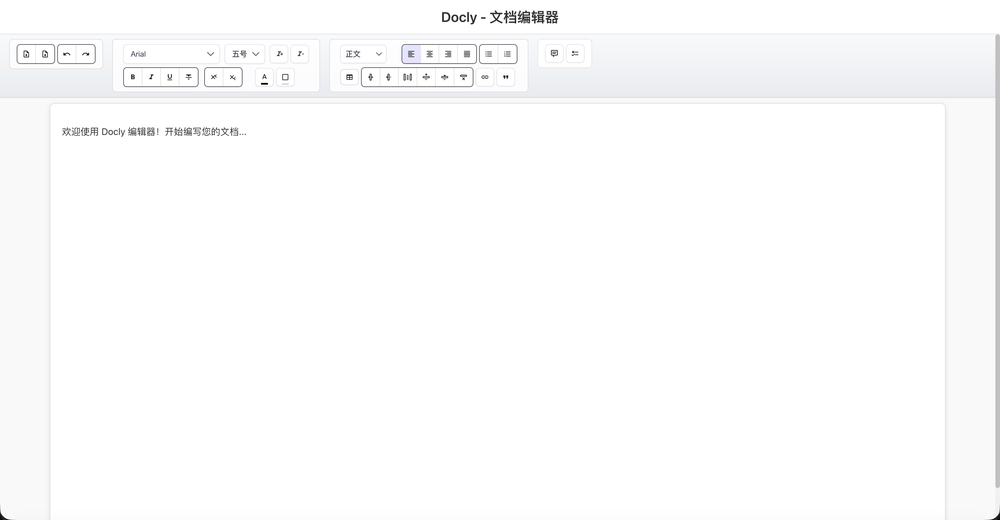
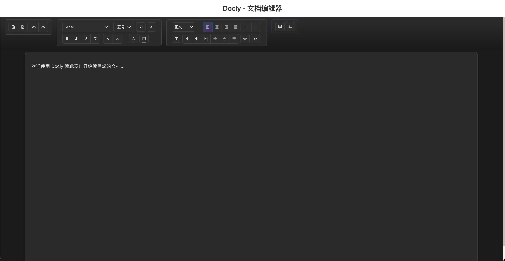

# Docly - 在线文档编辑器

Docly 是一款基于 Vue 3 + Vite 的现代化在线文档编辑器，专注于 Word 文件的编辑、导入导出与高级文本处理功能。

## 界面预览




*Docly 编辑器主界面展示了完整的富文本编辑功能，包括工具栏、编辑区域和状态栏*

## 功能特色

### 🚀 现代化架构
- 基于 Vue 3 + Vite 的现代化架构
- 组合式API架构设计
- 响应式设计，支持多设备

### ✏️ 强大的编辑功能
- 强大的富文本编辑功能（基于 Tiptap）
- 多种编辑器工具（标题、段落、列表、引用、表格、代码块、链接、下划线、高亮等）
- 自定义字体样式和格式化选项
- 文档结构化编辑和导航

### 📄 Word 文档支持
- 完整的 Word 文档导入导出支持
- 高级文本分析与样式保持功能
- 智能字体处理（支持楷体、仿宋、小标宋等中文字体）
- 文档预览功能

### 🔧 高级功能
- 完整的批注系统支持
- 颜色选择器和主题支持
- 编辑器状态栏显示
- 工具提示系统
- 插件化架构，易于扩展
- 实时保存与状态管理
- 统一的快捷键管理系统
- 彩色控制台日志输出
- 用户友好的消息提示系统

## 技术栈

- **前端框架**: Vue 3.5.18 + Vite 5.4.20
- **编辑器核心**: Tiptap 3.5.3 + 多个官方扩展
  - @tiptap/starter-kit 3.5.3 (基础功能包)
  - @tiptap/extension-underline 3.5.3 (下划线)
  - @tiptap/extension-text-style 3.5.3 (文本样式)
  - @tiptap/extension-table 3.5.3 (表格)
  - @tiptap/extension-table-row 3.5.3 (表格行)
  - @tiptap/extension-table-cell 3.5.3 (表格单元格)
  - @tiptap/extension-table-header 3.5.3 (表格头)
  - @tiptap/extension-code-block-lowlight 3.5.3 (代码块)
  - @tiptap/extension-highlight 3.5.3 (高亮)
  - @tiptap/extension-history 3.5.3 (历史记录)
- **状态管理**: Pinia 3.0.3
- **UI 组件库**: Naive UI 2.43.1
- **文件处理**: 
  - docx 9.5.1 (Word文档生成)
  - docx-preview 0.3.6 (Word预览)
  - docxtemplater 3.66.3 (Word模板)
  - file-saver 2.0.5 (文件保存)
  - jszip 3.10.1 (压缩文件处理)
- **工具库**: @vueuse/core 13.9.0 (Vue组合式工具)
- **类型支持**: TypeScript + @types/file-saver 2.0.7
- **构建工具**: Vite 5.4.20 + @vitejs/plugin-vue 5.2.4 + TypeScript 5.9.2

## 项目结构

```
src/
├── components/          # Vue 组件
│   ├── AnnotationSystem.vue  # 批注系统组件
│   ├── ColorPicker.vue       # 颜色选择器组件
│   ├── DoclyEditor.vue       # 主编辑器组件
│   ├── EditorStatusBar.vue   # 编辑器状态栏组件
│   ├── EditorToolbar.vue     # 编辑器工具栏组件
│   ├── FontTool.vue          # 字体工具组件
│   ├── ShortcutPanel.vue     # 快捷键面板组件
│   ├── TiptapEditor.vue      # Tiptap 编辑器组件
│   └── Tooltip.vue           # 工具提示组件
├── composables/        # Vue 组合式函数
│   ├── useAnnotations.ts     # 批注功能组合式函数
│   ├── useEditorState.ts     # 编辑器状态管理组合式函数
│   ├── useFileHandler.ts     # 文件处理组合式函数
│   ├── useShortcuts.ts       # 快捷键管理组合式函数
│   ├── useTheme.ts           # 主题管理组合式函数
│   └── useTooltip.ts         # 工具提示组合式函数
├── core/               # 编辑器核心
│   ├── TiptapCore.ts   # Tiptap 编辑器核心类，提供完整的编辑器功能
│   └── ShortcutManager.ts    # 快捷键管理器，统一管理应用快捷键
├── adapters/           # 数据适配器
│   └── TiptapDataAdapter.ts  # Tiptap 数据适配器，处理数据格式转换
├── extensions/         # Tiptap 扩展
│   ├── FontFamily.ts   # 字体族扩展
│   ├── FontSize.ts     # 字体大小扩展
│   └── TextAlign.ts    # 文本对齐扩展
├── plugins/            # 插件系统
│   └── PluginManager.ts # 插件管理器，支持动态加载和管理插件
├── fileHandlers/       # 文件处理模块
│   └── WordHandler.ts        # Word文件处理器，支持导入导出和预览
├── stores/             # 状态管理
│   └── editorStore.ts  # 编辑器状态管理，基于 Pinia
├── types/              # TypeScript类型定义
│   ├── editorjs-marker.d.ts  # Editor.js标记插件类型定义
│   └── index.ts        # 完整的类型定义文件
├── utils/              # 工具函数
│   ├── Console.ts      # 控制台工具类，提供彩色日志输出
│   └── Message.ts      # 消息提示工具，显示用户反馈信息
├── assets/             # 静态资源
│   ├── css/            # 样式文件
│   │   ├── components.css  # 组件样式
│   │   ├── editor.css      # 编辑器样式
│   │   ├── fonts.css       # 字体样式定义
│   │   ├── global.css      # 全局样式
│   │   └── style.css       # 主样式文件
│   ├── fonts/          # 字体文件
│   │   ├── 仿宋_GB2312.ttf    # 仿宋字体
│   │   ├── 方正小标宋简体.ttf   # 小标宋字体
│   │   └── 楷体_GB2312.ttf    # 楷体字体
│   ├── favicon.ico     # 网站图标
│   └── logo.png        # 项目Logo
├── App.vue             # 根组件
└── main.js             # 应用入口文件
```

## 快速开始

### 📋 环境要求

- Node.js 16.0+ 
- npm 7.0+ 或 yarn 1.22+
- 现代浏览器（Chrome 88+, Firefox 85+, Safari 14+, Edge 88+）

### 🛠️ 安装与运行

1. **安装依赖**
   ```bash
   npm install
   ```

2. **启动开发服务器**
   ```bash
   npm run dev
   ```
   访问 `http://localhost:5174` 查看应用

3. **构建生产版本**
   ```bash
   npm run build
   ```

4. **预览生产构建**
   ```bash
   npm run preview
   ```

## 📚 核心功能使用

### 编辑器初始化

```javascript
import { TiptapCore } from './core/TiptapCore'

const editor = new TiptapCore({
  holder: 'editor-container',
  config: {
    placeholder: '开始编写您的文档...',
    autofocus: true
  }
})

await editor.init()
```

### Word 文档处理

```javascript
import { WordHandler } from './fileHandlers/WordHandler'

const wordHandler = new WordHandler()

// 导入 Word 文档
const fileInput = document.querySelector('#file-input')
const file = fileInput.files[0]
const html = await wordHandler.importToHtml(file)

// 导出为 Word 文档
const html = editor.getHTML()
const exportedFile = await wordHandler.exportFromHtml(html)
```

### 数据格式转换

```javascript
import { TiptapDataAdapter } from './adapters/TiptapDataAdapter'

const adapter = new TiptapDataAdapter()

// 将 Tiptap HTML 转换为 Editor.js 数据格式
const html = editor.getHTML()
const editorData = adapter.htmlToEditorData(html)

// 将 Editor.js 数据格式转换为 Tiptap HTML
const html = adapter.editorDataToHtml(editorData)
editor.setContent(html)
```

## 📖 API 文档

### TiptapCore

Tiptap 编辑器核心类，提供完整的编辑器功能。

#### 方法

- `init()`: 初始化编辑器
- `save()`: 保存编辑器数据
- `render(data)`: 渲染编辑器数据
- `destroy()`: 销毁编辑器实例
- `getHTML()`: 获取编辑器 HTML 内容
- `getText()`: 获取编辑器纯文本内容
- `setContent(content)`: 设置编辑器内容
- `focus()`: 聚焦编辑器
- `isEmpty()`: 检查编辑器是否为空

### TiptapDataAdapter

Tiptap 数据适配器，负责在 Tiptap HTML 格式和 Editor.js 数据格式之间进行转换。

#### 方法

- `htmlToEditorData(html)`: 将 Tiptap HTML 转换为 Editor.js 数据格式
- `editorDataToHtml(data)`: 将 Editor.js 数据格式转换为 Tiptap HTML
- `sanitizeHtml(html)`: 清理和验证 HTML 内容

### WordHandler

Word 文档处理器，支持导入导出和预览。

#### 方法

- `importToHtml(file)`: 导入 Word 文档并转换为 HTML
- `exportFromHtml(html)`: 从 HTML 导出为 Word 文档
- `preview(data)`: 生成预览

### PluginManager

插件管理器，支持动态加载和管理插件。

#### 方法

- `registerPlugin(plugin)`: 注册插件
- `loadPlugin(name, config)`: 加载插件
- `unloadPlugin(name)`: 卸载插件
- `getPlugin(name)`: 获取插件实例

### ShortcutManager

快捷键管理器，统一管理应用中的所有快捷键。

#### 方法

- `registerShortcut(key, config)`: 注册快捷键
- `unregisterShortcut(key)`: 注销快捷键
- `setShortcutEnabled(key, enabled)`: 启用/禁用指定快捷键
- `setEnabled(enabled)`: 启用/禁用整个快捷键管理器
- `getAllShortcuts()`: 获取所有快捷键
- `getShortcutsByGroup(groupId)`: 根据分组获取快捷键
- `addGroup(id, group)`: 添加快捷键分组
- `exportConfig()`: 导出快捷键配置
- `importConfig(config)`: 导入快捷键配置

### Console

控制台工具类，提供彩色日志输出功能。

#### 方法

- `success(...args)`: 输出成功日志（绿色）
- `error(...args)`: 输出错误日志（红色）
- `warn(...args)`: 输出警告日志（黄色）
- `info(...args)`: 输出信息日志（蓝色）
- `debug(...args)`: 输出调试日志（灰色）
- `setLogLevel(level)`: 设置日志级别
- `clear()`: 清空控制台
- `table(data)`: 打印表格
- `group(label)`: 开始分组
- `groupEnd()`: 结束分组
- `time(label)`: 开始计时
- `timeEnd(label)`: 结束计时

### Message

消息提示工具，显示用户反馈信息。

#### 方法

- `showMessage(text, type, consoleTag)`: 显示消息提示
  - `text`: 消息文本
  - `type`: 消息类型（'success' | 'error' | 'warn' | 'info'）
  - `consoleTag`: 是否同时在控制台输出（默认 true）

### 组合式函数 (Composables)

#### useShortcuts

快捷键管理的组合式函数。

```javascript
const {
  isShortcutPanelVisible,
  registerEditorShortcuts,
  registerShortcut,
  unregisterShortcut,
  setShortcutEnabled,
  setShortcutsEnabled,
  showShortcutPanel,
  hideShortcutPanel,
  toggleShortcutPanel,
  getAllShortcuts,
  getShortcutsByGroup,
  exportShortcutConfig,
  importShortcutConfig
} = useShortcuts()
```

#### useAnnotations

批注功能的组合式函数。

```javascript
const {
  annotations,
  addAnnotation,
  removeAnnotation,
  updateAnnotation,
  getAnnotationsByRange
} = useAnnotations()
```

#### useEditorState

编辑器状态管理的组合式函数。

```javascript
const {
  editorData,
  isModified,
  currentBlock,
  saveState,
  restoreState
} = useEditorState()
```

#### useFileHandler

文件处理功能的组合式函数。

```javascript
const {
  importFile,
  exportFile,
  supportedFormats,
  isProcessing
} = useFileHandler()
```

#### useTheme

主题管理的组合式函数。

```javascript
const {
  currentTheme,
  setTheme,
  toggleTheme,
  availableThemes
} = useTheme()
```

## 🛠️ 开发指南

### 开发环境设置

1. 克隆项目
```bash
git clone <repository-url>
cd Docly
```

2. 安装依赖
```bash
npm install
```

3. 启动开发服务器
```bash
npm run dev
```

### 项目架构

Docly 采用模块化架构设计：

- **核心层 (Core)**: 提供编辑器基础功能
- **插件层 (Plugins)**: 可扩展的插件系统
- **处理层 (Handlers)**: 文件处理和格式转换
- **工具层 (Utils)**: 通用工具和辅助函数
- **界面层 (Components)**: Vue 组件和用户界面

### 添加新功能

1. **添加新的编辑器插件**
```javascript
// 在 plugins/ 目录下创建新插件
export class MyPlugin implements EditorPlugin {
  name = 'my-plugin'
  
  init(editor: EditorInstance): void {
    // 插件初始化逻辑
  }
}
```

2. **扩展文件处理器**
```javascript
// 在 fileHandlers/ 目录下扩展处理器
export class MyFileHandler implements FileHandler {
  async import(file: File): Promise<EditorData> {
    // 文件导入逻辑
  }
  
  async export(data: EditorData): Promise<File> {
    // 文件导出逻辑
  }
}
```

3. **创建新的组合式函数**
```javascript
// 在 composables/ 目录下创建新的组合式函数
import { ref, computed } from 'vue'

export function useMyFeature() {
  const state = ref(null)
  const isActive = computed(() => state.value !== null)
  
  const activate = () => {
    // 激活功能逻辑
  }
  
  const deactivate = () => {
    // 停用功能逻辑
  }
  
  return {
    state,
    isActive,
    activate,
    deactivate
  }
}
```

4. **添加新的UI组件**
```vue
<!-- 在 components/ 目录下创建新组件 -->
<template>
  <div class="my-component">
    <!-- 组件模板 -->
  </div>
</template>

<script setup lang="ts">
// 组件逻辑，使用组合式API
interface Props {
  // 定义组件属性
}

const props = defineProps<Props>()
const emit = defineEmits<{
  // 定义组件事件
}>()
</script>

<style scoped>
/* 组件样式 */
.my-component {
  /* 样式定义 */
}
</style>
```

### 代码规范

- 使用 TypeScript 进行类型安全开发
- 遵循 Vue 3 Composition API 最佳实践
- 为所有公共方法添加 JSDoc 注释
- 使用 ESLint 和 Prettier 保持代码风格一致

### 测试

```bash
# 运行单元测试
npm run test

# 运行端到端测试
npm run test:e2e

# 生成测试覆盖率报告
npm run test:coverage
```

### 构建和部署

```bash
# 构建生产版本
npm run build

# 预览构建结果
npm run preview

# 分析构建包大小
npm run analyze
```

## 🤝 贡献指南

我们欢迎所有形式的贡献！请遵循以下步骤：

1. Fork 本项目
2. 创建功能分支 (`git checkout -b feature/AmazingFeature`)
3. 提交更改 (`git commit -m 'Add some AmazingFeature'`)
4. 推送到分支 (`git push origin feature/AmazingFeature`)
5. 创建 Pull Request

### 提交规范

使用 [Conventional Commits](https://www.conventionalcommits.org/) 规范：

- `feat`: 新功能
- `fix`: 修复问题
- `docs`: 文档更新
- `style`: 代码格式调整
- `refactor`: 代码重构
- `test`: 测试相关
- `chore`: 构建过程或辅助工具的变动

## ❓ 常见问题

### Q: 如何添加自定义字体支持？

A: 在 <mcfolder name="fonts" path="src/assets/fonts/"></mcfolder> 目录下添加字体文件，然后在 <mcfile name="fonts.css" path="src/assets/css/fonts.css"></mcfile> 中定义字体样式。

### Q: 如何扩展 Word 文档的导入支持？

A: 修改 <mcfile name="WordHandler.ts" path="src/fileHandlers/WordHandler.ts"></mcfile> 中的 `importToHtml` 方法，添加对新元素类型的处理逻辑。

### Q: 如何自定义编辑器工具栏？

A: 在 <mcsymbol name="TiptapCore" filename="TiptapCore.ts" path="src/core/TiptapCore.ts" startline="1" type="class"></mcsymbol> 初始化时配置扩展参数，启用或禁用特定的编辑器工具。

### Q: 如何使用 Tiptap 编辑器组件？

A: 使用 <mcfile name="TiptapEditor.vue" path="src/components/TiptapEditor.vue"></mcfile> 组件，它提供了完整的 Tiptap 编辑器功能和工具栏。

### Q: 如何显示快捷键面板？

A: 使用 <mcfile name="ShortcutPanel.vue" path="src/components/ShortcutPanel.vue"></mcfile> 组件，或通过 `useShortcuts` 组合式函数的 `showShortcutPanel` 方法显示。

### Q: 支持哪些中文字体？

A: 项目内置支持楷体、仿宋、方正小标宋简体等中文字体，字体文件位于 <mcfolder name="fonts" path="src/assets/fonts/"></mcfolder> 目录。

### Q: 如何使用批注系统？

A: 使用 <mcsymbol name="useAnnotations" filename="useAnnotations.ts" path="src/composables/useAnnotations.ts" startline="1" type="function"></mcsymbol> 组合式函数来管理批注，或直接使用 <mcfile name="AnnotationSystem.vue" path="src/components/AnnotationSystem.vue"></mcfile> 组件。

### Q: 如何切换主题？

A: 使用 <mcsymbol name="useTheme" filename="useTheme.ts" path="src/composables/useTheme.ts" startline="1" type="function"></mcsymbol> 组合式函数中的 `setTheme` 或 `toggleTheme` 方法来切换主题。

### Q: 如何自定义颜色选择器？

A: 修改 <mcfile name="ColorPicker.vue" path="src/components/ColorPicker.vue"></mcfile> 组件，添加自定义颜色预设或修改颜色选择逻辑。

### Q: 编辑器状态如何管理？

A: 项目使用 Pinia 进行全局状态管理（<mcfile name="editorStore.ts" path="src/stores/editorStore.ts"></mcfile>），同时提供 <mcsymbol name="useEditorState" filename="useEditorState.ts" path="src/composables/useEditorState.ts" startline="1" type="function"></mcsymbol> 组合式函数进行局部状态管理。

### Q: 如何使用快捷键系统？

A: 使用 <mcsymbol name="useShortcuts" filename="useShortcuts.ts" path="src/composables/useShortcuts.ts" startline="1" type="function"></mcsymbol> 组合式函数来管理快捷键，或直接使用 <mcsymbol name="ShortcutManager" filename="ShortcutManager.ts" path="src/core/ShortcutManager.ts" startline="1" type="class"></mcsymbol> 类。按 `Ctrl+/` 可显示快捷键面板。

### Q: 如何自定义控制台日志输出？

A: 使用 <mcsymbol name="Console" filename="Console.ts" path="src/utils/Console.ts" startline="1" type="class"></mcsymbol> 类的静态方法，如 `Console.success()`、`Console.error()` 等。可通过 `Console.setLogLevel()` 设置日志级别。

### Q: 如何显示用户消息提示？

A: 使用 <mcsymbol name="showMessage" filename="Message.ts" path="src/utils/Message.ts" startline="1" type="function"></mcsymbol> 函数显示消息提示，支持成功、错误、警告和信息四种类型。

### Q: 如何注册自定义快捷键？

A: 使用 `ShortcutManager.registerShortcut(key, config)` 方法注册快捷键，或通过 `useShortcuts` 组合式函数的 `registerShortcut` 方法。

## 📄 许可证

本项目采用 Apache License 2.0 许可证 - 详见 [LICENSE](LICENSE) 文件。
